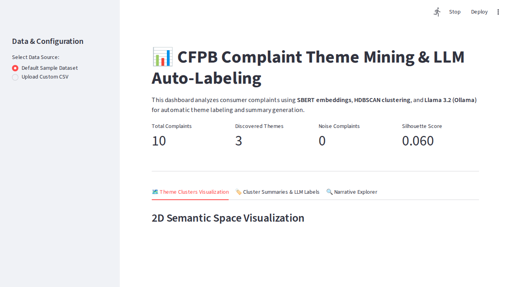

# Complaint Theme Mining & Auto-Labeling Pipeline

[](https://complaint-theme-mining-3cstps3mtevfgo8kbtunep.streamlit.app/) []() [](https://www.python.org/) [](https://streamlit.io/) [](https://www.sbert.net/) [](https://hdbscan.readthedocs.io/) [-purple.svg)](https://ollama.ai/) [](https://opensource.org/licenses/MIT)

An end-to-end NLP pipeline and interactive Streamlit dashboard designed to analyze 128,000+ Consumer Financial Protection Bureau (CFPB) complaint narratives. The pipeline leverages **SBERT embeddings**, **HDBSCAN clustering**, **c-TF-IDF keyword extraction**, and local **Llama 3.2 (via Ollama)** for automated theme labeling and summary generation.

🌐 **Live Interactive App:** [View Live Streamlit Dashboard](https://complaint-theme-mining-3cstps3mtevfgo8kbtunep.streamlit.app/)

<!--  -->

---

## 📌 Features

- **Batched SBERT Vectorization:** Efficient dense embedding generation using `all-MiniLM-L6-v2` with batch size controls (`batch_size=64`).
- **Density-Based Clustering:** HDBSCAN identifies naturally occurring complaint themes without specifying arbitrary cluster counts.
- **Soft Clustering & Membership Vectors:** Reassigns unclustered noise points (-1) to their highest probability cluster using HDBSCAN soft membership scores.
- **c-TF-IDF Keyword Extraction:** Class-based TF-IDF extracts top representative keywords per theme cluster.
- **Local LLM Auto-Labeling:** Integration with local Llama 3.2 (Ollama) to produce executive titles and summaries for each cluster, with automatic keyword-based fallback if LLM services are offline.
- **Interactive Streamlit Dashboard:** 2D PCA semantic projection scatter plots, theme filtering, metric summary cards, and narrative search with full Streamlit caching (`@st.cache_data`).

---

## 📈 Key Results & Model Performance

The table below highlights performance comparison between baseline approaches and the SBERT + UMAP + HDBSCAN architecture:

| Pipeline Model Strategy | Silhouette Score | Noise Ratio | Cluster Count | Key Characteristics |
|---|---|---|---|---|
| **TF-IDF + K-Means (Baseline)** | 0.028 | 0% | 15 (fixed) | High overlap, rigid cluster partitions, fails on semantic nuance. |
| **SBERT + UMAP + HDBSCAN (Primary)** | 0.569 | 42.9% | 32 (auto-discovered) | Dense semantic clustering, identifies fine-grained sub-themes. |

### Key Domain Insights & Findings

- **CFPB Sub-Category Breakdown:** Uncovered ~13 distinct sub-clusters within CFPB’s single broad category *"Problem with a purchase shown on your statement"*.
- **Credit-Repair Disruption:** Identified standardized and templated dispute letters originating from third-party credit-repair services across consumer credit reporting disputes.

---

## 📁 Project Structure

```text
complaint-theme-mining/
├── data/
│   ├── raw/                  # Raw complaint CSV files (Git-ignored)
│   ├── processed/            # Processed outputs with cluster assignments (Git-ignored)
│   └── sample_data.csv       # Tracked sample dataset (10 records) for demonstration
├── docs/
│   └── dashboard_preview.png # Dashboard screenshot image
├── src/
│   ├── __init__.py
│   ├── config.py             # Global pipeline parameters, model paths & API timeouts
│   ├── nlp_pipeline.py       # SBERT + HDBSCAN + c-TF-IDF + Soft Clustering pipeline
│   ├── llm_labeler.py        # Ollama Llama 3.2 auto-labeler & fallback engine
│   └── dashboard.py          # Interactive Streamlit dashboard application
├── tests/
│   └── test_pipeline.py      # Automated pytest suite
├── .gitignore                # Excludes large CSVs, models, and virtual environments
├── requirements.txt          # Explicit Python library dependencies
├── README.md                 # Complete repository documentation
└── SUMMARY.md                # Detailed refactoring analysis & benchmarks
```

---

## 🚀 Quick Start

### 1. Hardware & System Prerequisites

- **Python Version:** Python 3.10, 3.11, or 3.12
- **System Memory (RAM):**
  - Minimum 8 GB RAM (for running SBERT + HDBSCAN on sample data)
  - Recommended 16 GB+ RAM (for running 30,000+ complaint batches)
- **Ollama Local LLM Prerequisites:**
  - Recommended 8 GB+ RAM / 4 GB+ VRAM for running `llama3.2` model locally via Ollama.

### 2. Clone Repository & Setup Environment

```bash
# Clone the repository
git clone https://github.com/Radhika2004Dahiya/complaint-theme-mining.git
cd complaint-theme-mining

# Create virtual environment
python3 -m venv venv

# Activate virtual environment
# On Linux/macOS:
source venv/bin/activate
# On Windows:
# venv\Scripts\activate

# Install dependencies
pip install --upgrade pip
pip install -r requirements.txt
```

### 3. Local LLM (Ollama) Setup

Install [Ollama](https://ollama.ai/) and start the local model:

```bash
# Pull Llama 3.2 model
ollama pull llama3.2

# Start Ollama server
ollama serve
```
*Note: If Ollama is offline or uninstalled, the pipeline gracefully falls back to generating clean theme titles from c-TF-IDF keywords.*

### 4. Run the Streamlit Dashboard

Launch the interactive web application:
```bash
streamlit run src/dashboard.py
```
Open your browser at `http://localhost:8501`.

---

## 📊 Pipeline Overview

```
[ Raw Complaints Data ]
          │
          ▼
 [ SBERT Embedding (all-MiniLM-L6-v2) ]
          │
          ▼
   [ HDBSCAN Clustering ]
          │
  ┌───────┴────────┐
  ▼                ▼
[ c-TF-IDF ]  [ 2D PCA Mapping ]
  │                │
  ▼                │
[ Ollama Llama 3.2 Labeler ] ◄─ (Fallback to Keywords if offline)
  │                │
  └───────┬────────┘
          ▼
[ Streamlit Dashboard Visuals ]
```

---

## 🧪 Running Tests

Execute the automated pytest suite to verify all pipeline components and fallback logic:

```bash
python3 -m pytest
```

---

## 📄 License

This project is licensed under the MIT License - see the LICENSE file for details.
